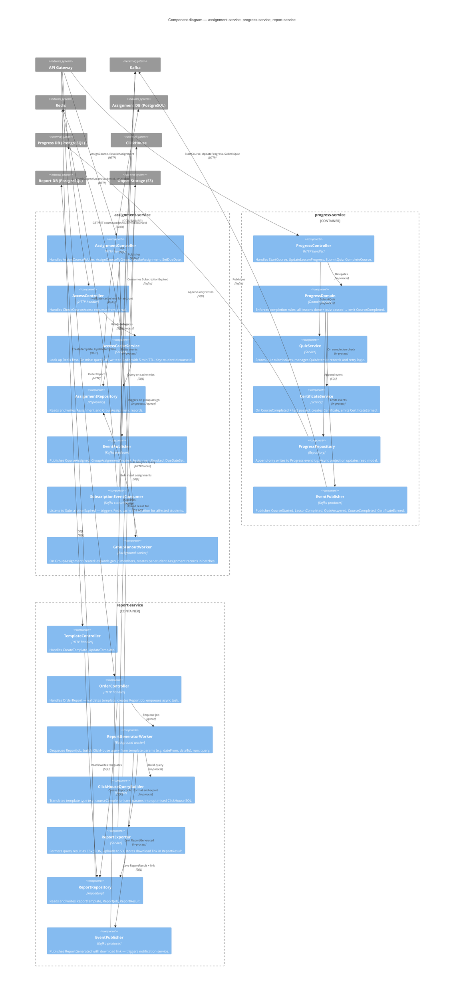

```mermaid
C4Component
    title Component diagram — assignment-service, progress-service, report-service

    System_Ext(gateway, "API Gateway")
    System_Ext(kafka, "Kafka")
    System_Ext(redis, "Redis")
    System_Ext(assignment_db, "Assignment DB (PostgreSQL)")
    System_Ext(progress_db, "Progress DB (PostgreSQL)")
    System_Ext(clickhouse, "ClickHouse")
    System_Ext(report_db, "Report DB (PostgreSQL)")
    System_Ext(object_store, "Object Storage (S3)")

    Container_Boundary(asvc, "assignment-service") {
        Component(assign_ctrl, "AssignmentController", "HTTP handler", "Handles AssignCourseToUser, AssignCourseToGroup, RevokeAssignment, SetDueDate.")
        Component(access_ctrl, "AccessController", "HTTP handler", "Handles CheckCourseAccess requests from portal.")
        Component(access_cache, "AccessCacheService", "Service", "Look up Redis first. On miss: query DB, write to Redis with 5 min TTL. Key: studentId:courseId.")
        Component(assign_repo, "AssignmentRepository", "Repository", "Reads and writes Assignment and GroupAssignment records.")
        Component(assign_publisher, "EventPublisher", "Kafka producer", "Publishes CourseAssigned, GroupAssignmentCreated, AssignmentRevoked, DueDateSet.")
        Component(sub_consumer, "SubscriptionEventConsumer", "Kafka consumer", "Listens to SubscriptionExpired — triggers Redis cache invalidation for affected students.")
        Component(fanout_worker, "GroupFanoutWorker", "Background worker", "On GroupAssignmentCreated: expands group members, creates per-student Assignment records in batches.")
    }

    Container_Boundary(psvc, "progress-service") {
        Component(progress_ctrl, "ProgressController", "HTTP handler", "Handles StartCourse, UpdateLessonProgress, SubmitQuiz, CompleteCourse.")
        Component(progress_domain, "ProgressDomain", "Domain service", "Enforces completion rules: all lessons done + quiz passed → emit CourseCompleted.")
        Component(quiz_svc, "QuizService", "Service", "Scores quiz submissions, manages QuizAttempt records and retry logic.")
        Component(cert_svc, "CertificateService", "Service", "On CourseCompleted + test passed: creates Certificate, emits CertificateEarned.")
        Component(progress_repo, "ProgressRepository", "Repository", "Append-only writes to Progress event log. Async projection updates read model.")
        Component(progress_publisher, "EventPublisher", "Kafka producer", "Publishes CourseStarted, LessonCompleted, QuizAnswered, CourseCompleted, CertificateEarned.")
    }

    Container_Boundary(rsvc, "report-service") {
        Component(template_ctrl, "TemplateController", "HTTP handler", "Handles CreateTemplate, UpdateTemplate.")
        Component(order_ctrl, "OrderController", "HTTP handler", "Handles OrderReport — validates template, creates ReportJob, enqueues async task.")
        Component(report_worker, "ReportGeneratorWorker", "Background worker", "Dequeues ReportJob, builds ClickHouse query from template params (e.g. dateFrom, dateTo), runs query.")
        Component(ch_query, "ClickHouseQueryBuilder", "Service", "Translates template type (e.g. courseCompletion) and params into optimised ClickHouse SQL.")
        Component(report_export, "ReportExporter", "Service", "Formats query result as CSV/JSON, uploads to S3, stores download link in ReportResult.")
        Component(report_repo, "ReportRepository", "Repository", "Reads and writes ReportTemplate, ReportJob, ReportResult.")
        Component(report_publisher, "EventPublisher", "Kafka producer", "Publishes ReportGenerated with download link — triggers notification-service.")
    }

    Rel(gateway, assign_ctrl, "AssignCourse, RevokeAssignment", "HTTP")
    Rel(gateway, access_ctrl, "CheckCourseAccess(studentId, courseId)", "HTTP")
    Rel(access_ctrl, access_cache, "Delegates", "in-process")
    Rel(access_cache, redis, "GET/SET courseaccess:studentId:courseId", "Redis")
    Rel(access_cache, assign_repo, "Query on cache miss", "SQL")
    Rel(assign_ctrl, assign_repo, "Reads/writes", "SQL")
    Rel(assign_ctrl, assign_publisher, "Emits events", "in-process")
    Rel(assign_publisher, kafka, "Publishes", "Kafka")
    Rel(assign_ctrl, fanout_worker, "Triggers on group assign", "in-process / queue")
    Rel(fanout_worker, assign_repo, "Bulk insert assignments", "SQL")
    Rel(sub_consumer, kafka, "Consumes SubscriptionExpired", "Kafka")
    Rel(sub_consumer, redis, "Invalidate cache keys for account", "Redis")
    Rel(assign_repo, assignment_db, "SQL", "SQL")

    Rel(gateway, progress_ctrl, "StartCourse, UpdateProgress, SubmitQuiz", "HTTP")
    Rel(progress_ctrl, progress_domain, "Delegates", "in-process")
    Rel(progress_ctrl, quiz_svc, "SubmitQuiz", "in-process")
    Rel(progress_domain, cert_svc, "On completion check", "in-process")
    Rel(progress_domain, progress_repo, "Append event", "SQL")
    Rel(progress_domain, progress_publisher, "Emits events", "in-process")
    Rel(progress_publisher, kafka, "Publishes", "Kafka")
    Rel(progress_repo, progress_db, "Append-only writes", "SQL")

    Rel(gateway, template_ctrl, "CreateTemplate, UpdateTemplate", "HTTP")
    Rel(gateway, order_ctrl, "OrderReport", "HTTP")
    Rel(order_ctrl, report_repo, "Create ReportJob", "SQL")
    Rel(order_ctrl, report_worker, "Enqueue job", "queue")
    Rel(report_worker, ch_query, "Build query", "in-process")
    Rel(ch_query, clickhouse, "Run analytics query", "HTTP/native")
    Rel(report_worker, report_export, "Format and export", "in-process")
    Rel(report_export, object_store, "Upload result file", "S3 API")
    Rel(report_export, report_repo, "Save ReportResult + link", "SQL")
    Rel(report_worker, report_publisher, "Emit ReportGenerated", "in-process")
    Rel(report_publisher, kafka, "Publishes", "Kafka")
    Rel(report_repo, report_db, "SQL", "SQL")
    Rel(template_ctrl, report_repo, "Reads/writes templates", "SQL")
```