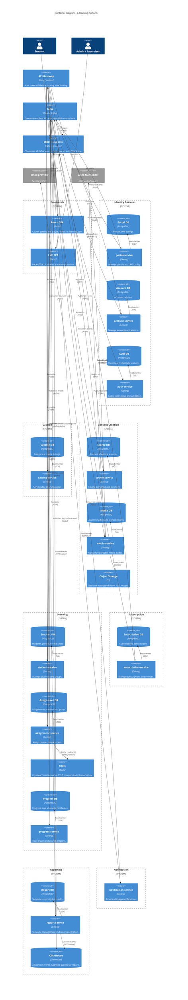

```mermaid

C4Container
  title Container diagram - e-learning platform

  Person(student, "Student")
  Person(admin, "Admin / Supervisor")

  System_Boundary(fe, "Front-ends") {
    Container(portal_fe, "Portal SPA", "React", "Course catalog and player. <code>.e-learning.com")
    Container(lms_fe, "LMS SPA", "React", "Back-office UI. <code>.e-learning.com/lms")
  }

  Container(gateway, "API Gateway", "Kong / custom", "Auth token validation, routing, rate limiting.")

  System_Boundary(identity, "Identity & Access") {
    ContainerDb(portal_db, "Portal DB", "PostgreSQL", "Portals, LMS configs.")
    Container(portal_svc, "portal-service", "Golang", "Manage portals and LMS config.")
    ContainerDb(account_db, "Account DB", "PostgreSQL", "Accounts, admins.")
    Container(account_svc, "account-service", "Golang", "Manage accounts and admins.")
    ContainerDb(auth_db, "Auth DB", "PostgreSQL", "Identities, credentials, sessions.")
    Container(auth_svc, "auth-service", "Golang", "Login, token issue and validation.")
  }

  System_Boundary(catalog_bc, "Catalog") {
    ContainerDb(catalog_db, "Catalog DB", "PostgreSQL", "Categories, course listings.")
    Container(catalog_svc, "catalog-service", "Golang", "Serve public course catalog.")
  }

  System_Boundary(content, "Content Creation") {
    ContainerDb(course_db, "Course DB", "PostgreSQL", "Courses, chapters, lessons.")
    Container(course_svc, "course-service", "Golang", "Course authoring and structure.")
    ContainerDb(media_db, "Media DB", "PostgreSQL", "Asset metadata and transcode jobs.")
    Container(media_svc, "media-service", "Golang", "Upload and process media assets.")
    Container(object_store, "Object Storage", "S3", "Raw and transcoded video, PDF, images.")
  }

  System_Boundary(learning, "Learning") {
    ContainerDb(student_db, "Student DB", "PostgreSQL", "Students, groups, license seats.")
    Container(student_svc, "student-service", "Golang", "Manage students and groups.")
    ContainerDb(assignment_db, "Assignment DB", "PostgreSQL", "Assignments per user and group.")
    Container(assignment_svc, "assignment-service", "Golang", "Assign courses, check access.")
    Container(redis, "Redis", "Redis", "CourseAccessView cache. TTL 5 min per student+course key.")
    ContainerDb(progress_db, "Progress DB", "PostgreSQL", "Progress, quiz attempts, certificates.")
    Container(progress_svc, "progress-service", "Golang", "Track lesson and course progress.")
  }

  System_Boundary(subscriptions, "Subscription") {
    ContainerDb(sub_db, "Subscription DB", "PostgreSQL", "Subscriptions, license pools.")
    Container(sub_svc, "subscription-service", "Golang", "Manage subscriptions and licenses.")
  }

  System_Boundary(reporting, "Reporting") {
    ContainerDb(report_db, "Report DB", "PostgreSQL", "Templates, report jobs, results.")
    Container(report_svc, "report-service", "Golang", "Template management and report generation.")
    ContainerDb(clickhouse, "ClickHouse", "ClickHouse", "All domain events. Analytics queries for reports.")
  }

  System_Boundary(notifications, "Notification") {
    Container(notif_svc, "notification-service", "Golang", "Email and in-app notifications.")
  }

  Container(kafka, "Kafka", "Apache Kafka", "Domain event bus. All services publish events here.")
  Container(ch_consumer, "ClickHouse sink", "Kafka consumer", "Consumes all Kafka topics, inserts events into ClickHouse.")

  System_Ext(email_ext, "Email provider", "SendGrid / SES")
  System_Ext(transcoder_ext, "Video transcoder", "AWS MediaConvert")

  Rel(student, portal_fe, "Uses", "HTTPS")
  Rel(admin, lms_fe, "Uses", "HTTPS")
  Rel(portal_fe, gateway, "API calls", "HTTPS/JSON")
  Rel(lms_fe, gateway, "API calls", "HTTPS/JSON")
  Rel(gateway, auth_svc, "ValidateToken", "gRPC/HTTP")
  Rel(gateway, portal_svc, "Routes to", "HTTP")
  Rel(gateway, account_svc, "Routes to", "HTTP")
  Rel(gateway, catalog_svc, "Routes to", "HTTP")
  Rel(gateway, course_svc, "Routes to", "HTTP")
  Rel(gateway, media_svc, "Routes to", "HTTP")
  Rel(gateway, student_svc, "Routes to", "HTTP")
  Rel(gateway, assignment_svc, "Routes to", "HTTP")
  Rel(gateway, progress_svc, "Routes to", "HTTP")
  Rel(gateway, sub_svc, "Routes to", "HTTP")
  Rel(gateway, report_svc, "Routes to", "HTTP")

  Rel(portal_svc, portal_db, "Reads/writes", "SQL")
  Rel(account_svc, account_db, "Reads/writes", "SQL")
  Rel(auth_svc, auth_db, "Reads/writes", "SQL")
  Rel(catalog_svc, catalog_db, "Reads/writes", "SQL")
  Rel(course_svc, course_db, "Reads/writes", "SQL")
  Rel(media_svc, media_db, "Reads/writes", "SQL")
  Rel(media_svc, object_store, "Stores assets", "S3 API")
  Rel(student_svc, student_db, "Reads/writes", "SQL")
  Rel(assignment_svc, assignment_db, "Reads/writes", "SQL")
  Rel(assignment_svc, redis, "Cache read/write", "Redis protocol")
  Rel(progress_svc, progress_db, "Reads/writes", "SQL")
  Rel(sub_svc, sub_db, "Reads/writes", "SQL")
  Rel(report_svc, report_db, "Reads/writes", "SQL")
  Rel(report_svc, clickhouse, "Queries events", "HTTP/native")

  Rel(portal_svc, kafka, "Publishes events", "Kafka")
  Rel(account_svc, kafka, "Publishes events", "Kafka")
  Rel(course_svc, kafka, "Publishes events", "Kafka")
  Rel(media_svc, kafka, "Publishes events", "Kafka")
  Rel(student_svc, kafka, "Publishes events", "Kafka")
  Rel(assignment_svc, kafka, "Publishes events", "Kafka")
  Rel(progress_svc, kafka, "Publishes events", "Kafka")
  Rel(sub_svc, kafka, "Publishes events", "Kafka")
  Rel(report_svc, kafka, "Publishes ReportGenerated", "Kafka")

  Rel(kafka, ch_consumer, "All topics", "Kafka")
  Rel(ch_consumer, clickhouse, "Inserts events", "HTTP/native")
  Rel(kafka, notif_svc, "Consumes events", "Kafka")
  Rel(kafka, assignment_svc, "Consumes SubscriptionExpired", "Kafka")
  Rel(kafka, catalog_svc, "Consumes CourseCreated", "Kafka")
  Rel(notif_svc, email_ext, "Sends emails", "SMTP/API")
  Rel(media_svc, transcoder_ext, "Submits jobs", "API")
  Rel(transcoder_ext, media_svc, "Job callback", "Webhook")
```