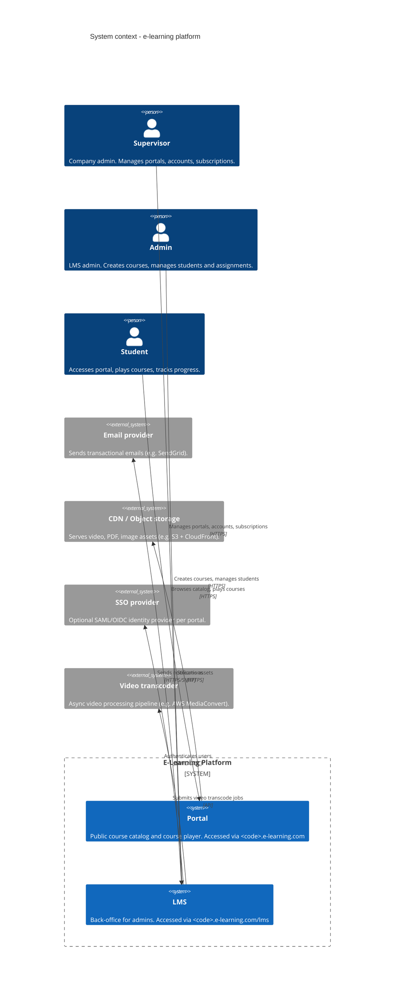

```mermaid
C4Context
  title System context - e-learning platform

  Person(supervisor, "Supervisor", "Company admin. Manages portals, accounts, subscriptions.")
  Person(admin, "Admin", "LMS admin. Creates courses, manages students and assignments.")
  Person(student, "Student", "Accesses portal, plays courses, tracks progress.")

  System_Boundary(elearning, "E-Learning Platform") {
    System(portal, "Portal", "Public course catalog and course player. Accessed via <code>.e-learning.com")
    System(lms, "LMS", "Back-office for admins. Accessed via <code>.e-learning.com/lms")
  }

  System_Ext(email, "Email provider", "Sends transactional emails (e.g. SendGrid).")
  System_Ext(cdn, "CDN / Object storage", "Serves video, PDF, image assets (e.g. S3 + CloudFront).")
  System_Ext(sso, "SSO provider", "Optional SAML/OIDC identity provider per portal.")
  System_Ext(transcoder, "Video transcoder", "Async video processing pipeline (e.g. AWS MediaConvert).")

  Rel(supervisor, lms, "Manages portals, accounts, subscriptions", "HTTPS")
  Rel(admin, lms, "Creates courses, manages students", "HTTPS")
  Rel(student, portal, "Browses catalog, plays courses", "HTTPS")
  Rel(portal, cdn, "Streams assets", "HTTPS")
  Rel(lms, email, "Sends notifications", "HTTPS/SMTP")
  Rel(lms, sso, "Authenticates users", "SAML/OIDC")
  Rel(lms, transcoder, "Submits video transcode jobs", "API")
```