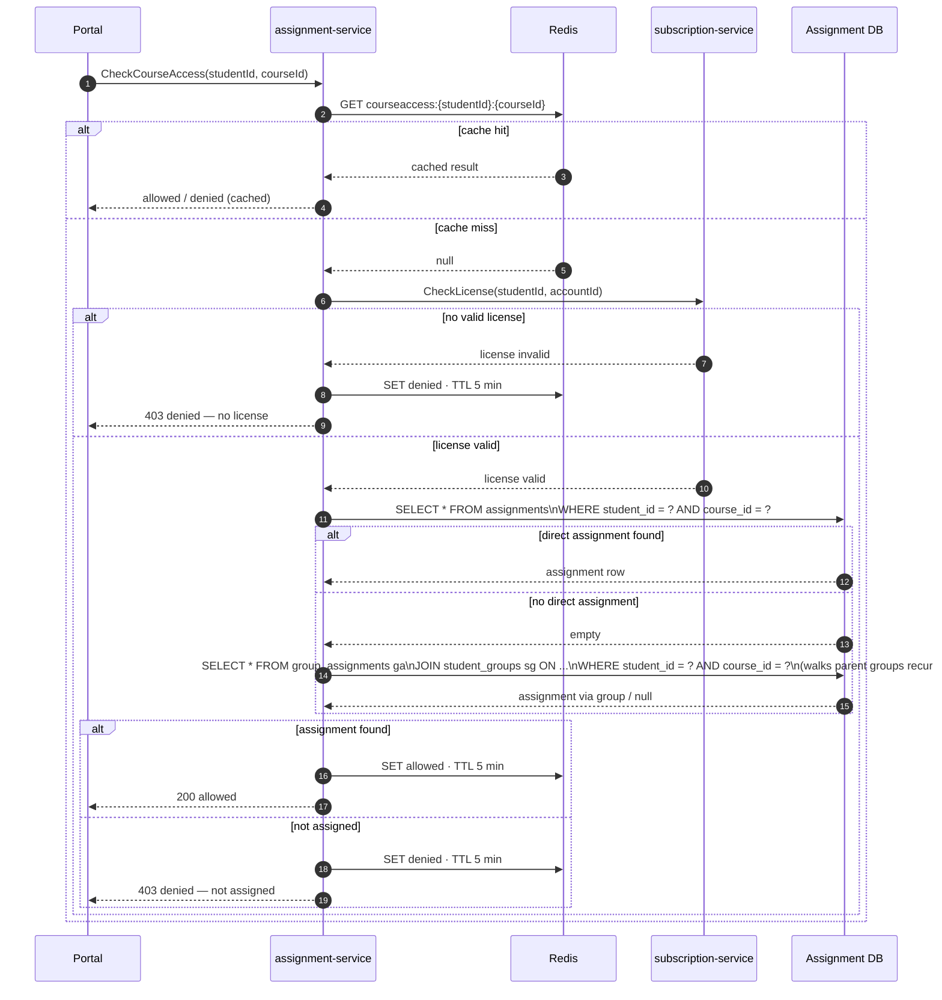

```mermaid
sequenceDiagram
    autonumber
    participant P as Portal
    participant AS as assignment-service
    participant R as Redis
    participant SS as subscription-service
    participant DB as Assignment DB

    P->>AS: CheckCourseAccess(studentId, courseId)

    AS->>R: GET courseaccess:{studentId}:{courseId}
    alt cache hit
        R-->>AS: cached result
        AS-->>P: allowed / denied (cached)
    else cache miss
        R-->>AS: null

        AS->>SS: CheckLicense(studentId, accountId)
        alt no valid license
            SS-->>AS: license invalid
            AS->>R: SET denied · TTL 5 min
            AS-->>P: 403 denied — no license
        else license valid
            SS-->>AS: license valid

            AS->>DB: SELECT * FROM assignments\nWHERE student_id = ? AND course_id = ?
            alt direct assignment found
                DB-->>AS: assignment row
            else no direct assignment
                DB-->>AS: empty

                AS->>DB: SELECT * FROM group_assignments ga\nJOIN student_groups sg ON ...\nWHERE student_id = ? AND course_id = ?\n(walks parent groups recursively)
                DB-->>AS: assignment via group / null
            end

            alt assignment found
                AS->>R: SET allowed · TTL 5 min
                AS-->>P: 200 allowed
            else not assigned
                AS->>R: SET denied · TTL 5 min
                AS-->>P: 403 denied — not assigned
            end
        end
    end
```