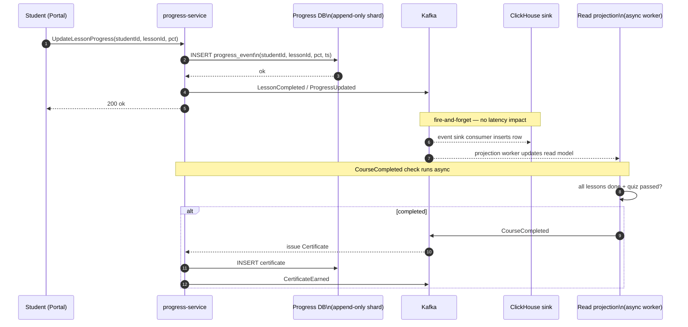

```mermaid
sequenceDiagram
    autonumber
    participant S as Student (Portal)
    participant PS as progress-service
    participant DB as Progress DB\n(append-only shard)
    participant K as Kafka
    participant CH as ClickHouse sink
    participant Proj as Read projection\n(async worker)

    S->>PS: UpdateLessonProgress(studentId, lessonId, pct)
    PS->>DB: INSERT progress_event\n(studentId, lessonId, pct, ts)
    DB-->>PS: ok
    PS->>K: LessonCompleted / ProgressUpdated
    PS-->>S: 200 ok

    Note over K,CH: fire-and-forget — no latency impact
    K-->>CH: event sink consumer inserts row
    K-->>Proj: projection worker updates read model

    Note over PS,Proj: CourseCompleted check runs async
    Proj->>Proj: all lessons done + quiz passed?
    alt completed
        Proj->>K: CourseCompleted
        K-->>PS: issue Certificate
        PS->>DB: INSERT certificate
        PS->>K: CertificateEarned
    end
```